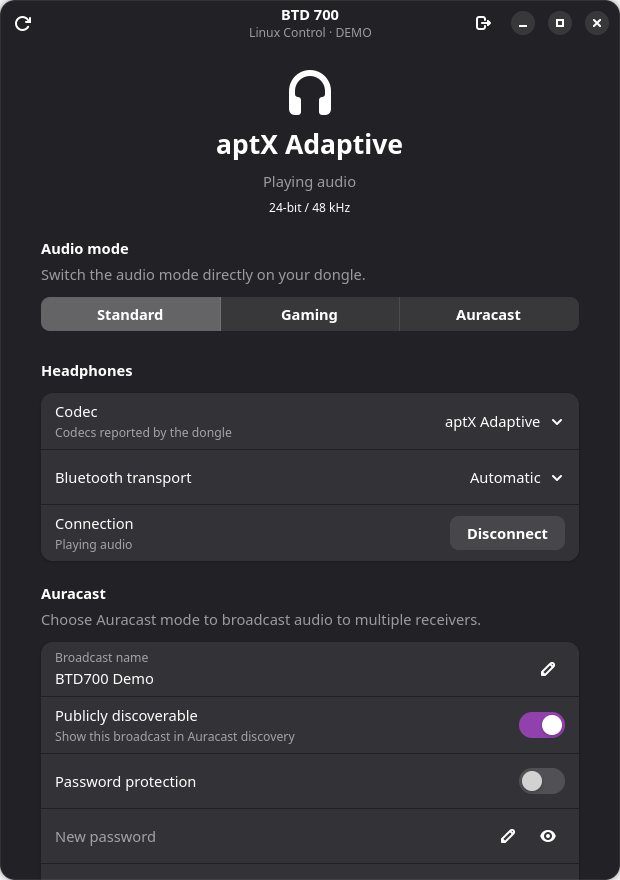
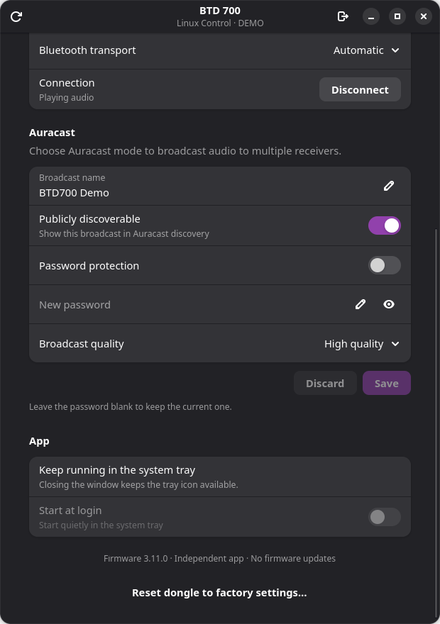

# BTD 700 Control für Linux

[English](README.md) · [Quellcode v0.2.0 herunterladen](https://github.com/justin-eckenweber/btd700linux/archive/refs/tags/v0.2.0.zip) · [Fehler melden](https://github.com/justin-eckenweber/btd700linux/issues)

Native GTK-4-App zur Steuerung des **Sennheiser BTD 700**, mit einem Menü im
Infobereich von GNOME/KDE. Eigenständige Implementierung des HID-Steuerprotokolls,
analysiert anhand der offiziellen Windows-Anwendung **Dongle Control 1.0.5**.

**Keine Firmware-Updates, Firmware-Downloads oder Update-Schnittstellen.** Die App
benötigt weder Windows/Wine noch eine Netzwerkverbindung. Sennheiser-Programmcode,
Logos und Firmware werden nicht mitgeliefert. Dies ist ein unabhängiges Projekt.

> **Mit KI entwickelt · Experimentell · Ohne Gewähr**
>
> Dieses Projekt entstand mit KI-Unterstützung durch OpenAI Codex, einschließlich
> Protokollanalyse, Implementierung, Dokumentation und Tests. Es gibt **keine
> Garantie, dass es mit deinem Dongle, deiner Firmware oder deinem Linux-System
> funktioniert**. Nutzung auf eigenes Risiko; die Software wird im vorhandenen
> Zustand ohne Gewährleistung unter der [MIT-Lizenz](LICENSE) bereitgestellt.
> Das Projekt ist unabhängig von Sennheiser und Sonova.

## Bilder der App

Echte Fensteraufnahmen unter Linux mit ausdrücklich simulierten Demo-Daten.
Die Bilder zeigen die englische Oberfläche; Deutsch ist ebenfalls enthalten.

<p>
  
  
</p>

## Herunterladen

```bash
git clone https://github.com/justin-eckenweber/btd700linux.git
cd btd700linux
```

Alternativ die oben verlinkte ZIP-Datei entpacken und `bash run.sh` im Projektordner
ausführen. Die aktuelle Version wird als Quellcode verteilt; es gibt noch kein
AppImage, Flatpak oder eigenständiges Binärpaket.

## Starten

```bash
./run.sh
```

Das Fenster zeigt den echten Dongle-Status. Beim Schließen bleibt die App im
Infobereich aktiv. „Beenden“ im Symbolmenü oder das Beenden-Symbol im Fenster
beendet die App vollständig. Wenn der Desktop keinen Infobereich anbietet,
beendet das Schließen des Fensters die App.

```bash
python3 install.py       # Anwendungsmenü-Eintrag für diesen Projektordner
./run.sh --background   # Nur im Infobereich starten
./run.sh --demo         # Simulierter Dongle, keinerlei USB-Zugriff
```

Mit `python3 install.py --uninstall` entfernst du den Menüeintrag und Autostart.
Den Projektordner nach der Installation behalten. „Beim Anmelden starten“ in der
App aktiviert bei Bedarf den Autostart im Infobereich. Er ist standardmäßig aus.

## Sprache

Die App, das Infobereich-Menü, CLI-Hilfe und Fehlermeldungen verwenden auf deutschen
Systemen Deutsch und sonst Englisch. Bei Bedarf explizit festlegen:

```bash
./run.sh --language de
./run.sh --language en
BTD700_LANGUAGE=de ./run.sh --background
```

Eine bereits laufende Instanz vorher über „Beenden“ schließen. Ein weiterer Start
öffnet sonst das bestehende Fenster in seiner bisherigen Sprache.

## Steuerung

- **Standard / Gaming / Auracast** direkt im Fenster oder Symbolmenü wählen.
- Aktiven **Codec, Auflösung, Abtastrate und Verbindungsstatus** ablesen.
- **Codecs** auswählen, die der Dongle für die aktuelle Verbindung meldet.
  Die Auswahl steht im Standard-Modus zur Verfügung; Gaming setzt seinen Codec selbst.
- **Bluetooth Classic / LE Audio / Automatisch** auswählen, entsprechend den
  vom angeschlossenen Kopfhörer gemeldeten Möglichkeiten.
- Bereits gekoppelte Kopfhörer **verbinden / trennen**.
- **Auracast:** Name, Passwortschutz, öffentliche Auffindbarkeit und Qualität.
  Das Symbolmenü bietet Schalter und Untermenüs; für Name/Passwort öffnet es die Eingabe im Fenster.
- **Werkseinstellungen** nur nach ausdrücklicher Bestätigung im Dialog. Dabei
  werden die Kopplungen gelöscht. Die App führt niemals automatisch einen Reset aus.

Das Passwort wird verdeckt eingegeben und weder gespeichert noch protokolliert.
Ein leeres Passwortfeld behält das bisherige Passwort; „Passwortschutz“ ausschalten
sendet ohne Passwortschutz. Der Name erlaubt 4–16 ASCII-Buchstaben/Ziffern mit
inneren Leerzeichen; ein leerer Name stellt den Gerätenamen wieder her. Passwörter
verwenden 4–16 ASCII-Buchstaben/Ziffern, entsprechend den Original-Eingabegrenzen.

**„Öffentlich auffindbar“ ist die Auracast-Ankündigung, kein Ein/Aus-Schalter für
Audio.** Zum Starten/Beenden der Übertragung den Audiomodus umstellen.
Die angezeigten Bit-/kHz-Werte stammen vom Dongle. Die USB-Abtastrate wird vom
Audiosystem (z. B. PipeWire) bestimmt und ist kein hier nachgewiesener Stellbefehl.
Koppeln erfolgt über die Taste am Dongle; „Verbinden“ versucht die bestehende Kopplung.

## Voraussetzungen

Python ≥ 3.10, PyGObject, GTK ≥ 4.10, libadwaita ≥ 1.5 und libdbusmenu mit
GObject-Introspection. Auf dem hier verwendeten Bazzite sind die benötigten
Bibliotheken bereits vorhanden; keine zusätzlichen Pakete waren erforderlich.

Für andere Systeme typischerweise:

```bash
# Fedora (klassisch, veränderliches System)
sudo dnf install python3-gobject gtk4 libadwaita libdbusmenu

# Debian / Ubuntu
sudo apt install python3-gi gir1.2-gtk-4.0 gir1.2-adw-1 gir1.2-dbusmenu-glib-0.4
```

Auf GNOME muss der Desktop StatusNotifier/AppIndicator-Symbole unterstützen;
beispielsweise mit „AppIndicator and KStatusNotifierItem Support“. Auf dem
getesteten GNOME ist derselbe Dienst bereits für JetBrains Toolbox und andere Apps aktiv.
KDE stellt diese Schnittstelle über seinen Infobereich bereit.

Fehlt die Menü-Bibliothek, bleibt das Fenster nutzbar. Das Terminalinterface
benötigt ausschließlich die Python-Standardbibliothek.

## USB-Zugriff

Es wird ausschließlich die passende HID-Steuerschnittstelle des Geräts
`3542:3001` geöffnet, identifiziert über ihren Report-Deskriptor. Die zweite
Schnittstelle für Updates bleibt geschlossen. Audiotreiber werden nicht getrennt.

Falls die App fehlende Berechtigungen meldet:

```bash
sudo install -m 0644 packaging/70-btd700-control.rules /etc/udev/rules.d/70-btd700-control.rules
sudo udevadm control --reload-rules
```

Anschließend den Dongle aus- und wieder einstecken. Die Regel beschränkt den Zugriff
auf die Steuerungsschnittstelle und den aktiven lokalen Benutzer. Die App nicht
als root starten. Auf dem getesteten System ist bereits Zugriff vorhanden.

## Terminal

```bash
./run.sh devices
./run.sh status
./run.sh mode standard
./run.sh mode gaming
./run.sh mode standard --transport auto
./run.sh codec adaptive
./run.sh disconnect
./run.sh connect
./run.sh auracast --name 'Wohnzimmer' --quality high --public on
./run.sh auracast --password --encryption on  # Passwort verdeckt abfragen
./run.sh mode auracast
```

`status` gibt JSON aus und liest kein Passwort. Nur eine Instanz darf den Dongle
halten: Vor CLI-Befehlen eine laufende GUI über „Beenden“ schließen. Mehrere Dongles
lassen sich mit `--device /dev/hidrawN` vor dem Unterbefehl auswählen.

## Verifikation

```bash
python3 -m unittest discover -s tests -v
python3 tools/check_gui.py
```

`check_gui.py` verwendet **ausschließlich einen simulierten Dongle**, öffnet eine
Demo-Oberfläche in der bestehenden Sitzung und prüft die Menüaktionen über den
echten D-Bus-Menüexport. Es speichert Fensterbilder unter `/tmp/btd700-gui-test*.png`.

Nachgewiesen am angeschlossenen BTD 700 mit Firmware **3.11.0**:

- Erkennung und Öffnen der korrekten HID-Schnittstelle ohne Treiberwechsel.
- Echte Antworten auf Status-, Modus-, Codec-, Audioqualitäts-, LE-Zustands-,
  Transport-, Auracast-Konfigurations-, Namens- und Firmwareversionsabfragen.
- Anzeige im GTK-Fenster und Registrierung im GNOME-Infobereich.

Schreibbefehle wurden aus der Originalsoftware rekonstruiert und in Simulation
geprüft. Der Nutzer hat die Funktion der App am eigenen Dongle bestätigt. Eine
Aufschlüsselung aller dabei getesteten Funktionen liegt nicht vor; der automatisierte
Hardware-Umschalttest wurde bisher nicht ausgeführt.

Das vorbereitete `tools/check_hardware.py --run` schaltet Modi und Codec um,
prüft Auracast-Werte und versucht anschließend die gesicherten Originalwerte
wiederherzustellen. Es führt weder Firmware-Updates noch einen Werksreset aus.
Den Hardwaretest nur bewusst starten: Er unterbricht kurz die Audiowiedergabe
und verändert vorübergehend gespeicherte Einstellungen einschließlich des Passworts. Bei USB-Trennung während
einer Änderung ist eine Wiederherstellung nicht garantiert.

Protokoll, Herkunft und bekannte Grenzen: [docs/PROTOCOL.md](docs/PROTOCOL.md).


## Lizenz und Mitarbeit

Eigener Projektcode und Dokumentation stehen unter [MIT](LICENSE). Drittsoftware
und Herstellerkennzeichen behalten ihre eigenen Rechte; siehe
[THIRD_PARTY_NOTICES.md](THIRD_PARTY_NOTICES.md). Beiträge, Übersetzungen und
Kompatibilitätsberichte sind willkommen: [CONTRIBUTING.md](CONTRIBUTING.md).
